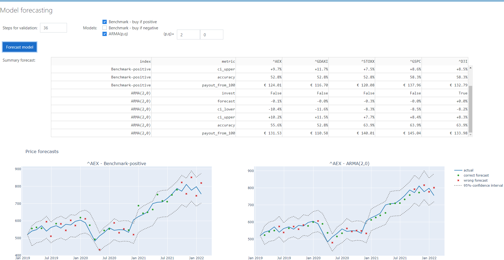

# Financial Market Dashboard
A visualisation tool for financial market data from [Yahoo finance](https://finance.yahoo.com/lookup) including data exploration and model forecasting. 
This dashboard is a Python Dash app that is deployed via docker.

Screenshot of the dashboard:


## Installation
Build and run the docker image with the following commands:
```
docker-compose build
docker compose up
```
The dashboard can be accessed in the browser via `http://localhost:5050` 


### Dependencies
* Docker Desktop or Docker Engine


## Description

### Data input
Allows specification of the tickers from [Yahoo finance](https://finance.yahoo.com/lookup), the start date, end date and the data frequency.

### Data exploration
Shows multiple figures (price, index, return, density) and a summary of the returns and statistics for the time series.   

### Model forecasting 
Performs a one-step-ahead forecast from the selected models. 
The models are validated by measuring the one-step-ahead forecast accuracy over a historic period, i.e. the number of validation steps. The following validation metrics are defined:

* _accuracy_: the percentage of correctly forecasting an increase or a decrease in the price;
* _payout_from_100_: the payout for following the model strategy* with 100 EUR (excl. transaction fees and difference bid-ask spread).

_*Buy if the model predicts a price increase, sell if the model predicts a price decrease._


## Next steps
More advanced models, for example Copula's, LSTM (recurrent neural network), Prophet (additive trend/seasonality model).


